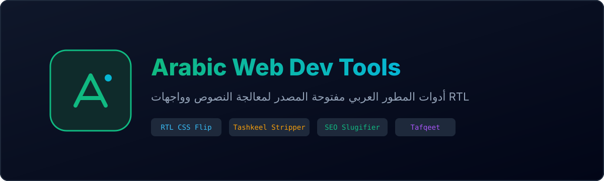

<p align="center">
  
</p>

# Arabic Web Dev Tools 🛠️ (أدوات المطور العربي)

<p align="center">
  <a href="https://opensource.org/licenses/MIT"></a>
  
  
  
</p>

A zero-dependency suite of production-ready web utilities and standalone interactive single-page applications tailored for developers building modern Arabic and RTL web experiences.

---

## ⚡ الميزات والأدوات المضمنة (Features)

| الأداة | الوصف | مثال |
| :--- | :--- | :--- |
| **RTL CSS & Tailwind Flip** | عكس وتعديل خواص الاتجاهات في كود CSS تلقائياً | `margin-left: 10px` ➔ `margin-right: 10px` |
| **Tashkeel Stripper** | تنظيف وحذف التشكيل والتنوين والمد (الكشيدة) بدقة فائقة | `مَرْحَبًا` ➔ `مرحبا` |
| **Keyboard Typo Fixer** | استعادة الكلمات المكتوبة بالخطأ بحروف إنجليزية أثناء نسيان الكيبورد | `lvpfn` ➔ `مرحبا` |
| **Normalizer** | توحيد الألفات والهمزات والتاء المربوطة لتسهيل الفهرسة ومحركات البحث | `إبراهيم، مدرسة` ➔ `ابراهيم، مدرسه` |

---

## 📦 التثبيت والاستخدام (Installation)

### عبر Node.js / NPM

```bash
npm install arabic-web-dev-tools
```

```javascript
import { stripTashkeel, normalizeArabic, convertToRtlCss, fixKeyboardTypo } from 'arabic-web-dev-tools';

// 1. إزالة التشكيل
console.log(stripTashkeel("بِسْمِ اللَّهِ الرَّحْمَٰنِ الرَّحِيمِ")); 
// => "بسم الله الرحمن الرحيم"

// 2. تصحيح خطأ الكيبورد
console.log(fixKeyboardTypo("lvpfn"));
// => "مرحبا"

// 3. تحويل CSS إلى RTL
console.log(convertToRtlCss(".sidebar { left: 0; padding-left: 15px; }"));
// => ".sidebar { right: 0; padding-right: 15px; }"
```

### واجهة الويب الجاهزة (Web UI)

المشروع يتضمن واجهة مستخدم كاملة وتفاعلية داخل مجلد `public/index.html` مبنية بأحدث معايير التصميم (Tailwind CSS) لتعمل مباشرة على المتصفح بدون أي خادم.

---

## 📄 License

This project is licensed under the MIT License - see the [LICENSE](LICENSE) file for details.

Developed with care by [Tarek Mohamed](https://tarek-mohamed.me.eg/).
